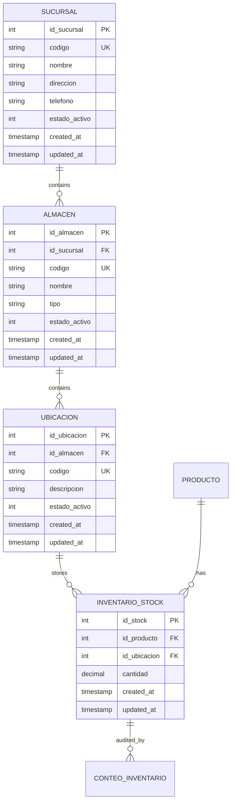

# Technical Design: Multisite Warehouse Foundation

## 1. System Architecture Overview

This design establishes the physical and organizational hierarchy for **Ferreterías El Constructor**, defining commercial branches (`sucursales`) and storage warehouses (`almacenes`), and associating physical locations (`ubicaciones`) with specific warehouses.

### Architectural Invariants Maintained:
- **Strict 3NF Data Model**: Stock grain remains strictly `(id_producto, id_ubicacion)`. No redundant warehouse or branch foreign keys on `inventario_stock`.
- **Command-Query Separation (CQS)**: Read operations return associative arrays; mutation operations accept `Transaction` or `Database` and return generated IDs or void.
- **Fail-Closed Security**: All new HTTP routes are registered in `RouteAccessPolicy` and enforced by `RoleGuard`.
- **Zero-Build Delivery**: Server-rendered pure PHP templates with Bulma 1.0.4 and HTMX 2.0.10.
- **Deterministic Decimals**: Quantities strictly use `DECIMAL(12,3)` formatted as strings.



---

## 2. Relational Schema & Normalization Analysis

### 2.1 Schema Definition

#### Table `sucursal`
```sql
CREATE TABLE `sucursal` (
    `id_sucursal` INT UNSIGNED AUTO_INCREMENT PRIMARY KEY,
    `codigo` VARCHAR(30) NOT NULL,
    `nombre` VARCHAR(100) NOT NULL,
    `direccion` VARCHAR(255) NULL,
    `telefono` VARCHAR(30) NULL,
    `estado_activo` TINYINT(1) NOT NULL DEFAULT 1,
    `created_at` TIMESTAMP NOT NULL DEFAULT CURRENT_TIMESTAMP,
    `updated_at` TIMESTAMP NOT NULL DEFAULT CURRENT_TIMESTAMP ON UPDATE CURRENT_TIMESTAMP,
    CONSTRAINT `uq_sucursal_codigo` UNIQUE (`codigo`),
    CONSTRAINT `chk_sucursal_estado` CHECK (`estado_activo` IN (0, 1))
) ENGINE=InnoDB DEFAULT CHARSET=utf8mb4 COLLATE=utf8mb4_unicode_ci;
```

#### Table `almacen`
```sql
CREATE TABLE `almacen` (
    `id_almacen` INT UNSIGNED AUTO_INCREMENT PRIMARY KEY,
    `id_sucursal` INT UNSIGNED NOT NULL,
    `codigo` VARCHAR(30) NOT NULL,
    `nombre` VARCHAR(100) NOT NULL,
    `tipo` VARCHAR(20) NOT NULL DEFAULT 'bodega',
    `estado_activo` TINYINT(1) NOT NULL DEFAULT 1,
    `created_at` TIMESTAMP NOT NULL DEFAULT CURRENT_TIMESTAMP,
    `updated_at` TIMESTAMP NOT NULL DEFAULT CURRENT_TIMESTAMP ON UPDATE CURRENT_TIMESTAMP,
    CONSTRAINT `uq_almacen_codigo` UNIQUE (`codigo`),
    CONSTRAINT `fk_almacen_sucursal` FOREIGN KEY (`id_sucursal`) REFERENCES `sucursal` (`id_sucursal`) ON DELETE RESTRICT,
    CONSTRAINT `chk_almacen_tipo` CHECK (`tipo` IN ('bodega', 'mostrador', 'patio', 'merma')),
    CONSTRAINT `chk_almacen_estado` CHECK (`estado_activo` IN (0, 1))
) ENGINE=InnoDB DEFAULT CHARSET=utf8mb4 COLLATE=utf8mb4_unicode_ci;
```

#### Modification to Table `ubicacion`
Add `id_almacen` as mandatory foreign key:
```sql
ALTER TABLE `ubicacion`
    ADD COLUMN `id_almacen` INT UNSIGNED NOT NULL AFTER `id_ubicacion`,
    ADD CONSTRAINT `fk_ubicacion_almacen` FOREIGN KEY (`id_almacen`) REFERENCES `almacen` (`id_almacen`) ON DELETE RESTRICT;
```

### 2.2 Normalization & Stock Grain Proof

Stock in Sistema Ferreto represents the physical quantity of a specific SKU stored at a specific physical coordinate.

- **Candidate Key of `inventario_stock`**: `(id_producto, id_ubicacion)`.
- **Functional Dependencies**:
  - `id_ubicacion -> id_almacen` (A location belongs to exactly one warehouse).
  - `id_almacen -> id_sucursal` (A warehouse belongs to exactly one branch).
- **Why Denormalizing `inventario_stock` is Rejected**:
  - If `id_almacen` were added to `inventario_stock`, we would have the dependency:
    `id_stock -> id_ubicacion -> id_almacen`.
  - This violates **Third Normal Form (3NF)** by introducing a transitive dependency.
  - Furthermore, if a location were ever updated or if data were inserted directly, an update anomaly could produce `inventario_stock.id_almacen != ubicacion.id_almacen`, corrupting inventory accounting.
- **Roll-Up Computation**:
  - Warehouse stock is computed dynamically:
    ```sql
    SELECT s.id_producto, SUM(s.cantidad) AS stock_almacen
    FROM inventario_stock s
    JOIN ubicacion u ON u.id_ubicacion = s.id_ubicacion
    WHERE u.id_almacen = :id_almacen AND s.id_producto = :id_producto
    GROUP BY s.id_producto;
    ```
  - Branch stock is computed dynamically:
    ```sql
    SELECT s.id_producto, SUM(s.cantidad) AS stock_sucursal
    FROM inventario_stock s
    JOIN ubicacion u ON u.id_ubicacion = s.id_ubicacion
    JOIN almacen a ON a.id_almacen = u.id_almacen
    WHERE a.id_sucursal = :id_sucursal AND s.id_producto = :id_producto
    GROUP BY s.id_producto;
    ```
  - Both queries use existing primary keys and foreign key indexes, guaranteeing sub-millisecond execution without redundant storage.

---

## 3. Database Migration & Backfill Strategy

### 3.1 Current Development Database Findings
Inspection of the local development database confirmed the presence of existing data:
- `ubicacion`: 2 rows (`CENTRAL`, `bod-a2`)
- `inventario_stock`: 2 rows
- `conteo_inventario`: 1 row

### 3.2 Additive Migration Design
To ensure deterministic execution across development, CI test suites, and production:

1. **Migration File `0008_create_sucursal.up.sql`**:
   - Creates table `sucursal`.
   - Inserts canonical initial branch record (`codigo = 'SUC-01'`, `nombre = 'Sucursal Central'`, `estado_activo = 1`) ONLY if the table is empty.

2. **Migration File `0009_create_almacen.up.sql`**:
   - Creates table `almacen`.
   - Inserts canonical initial warehouse record (`codigo = 'ALM-CENTRAL'`, `nombre = 'Almacén Central'`, `tipo = 'bodega'`, `id_sucursal = 1`, `estado_activo = 1`) ONLY if the table is empty.

3. **Migration File `0010_reparent_ubicacion_almacen.up.sql`**:
   - Adds nullable column `id_almacen INT UNSIGNED NULL AFTER id_ubicacion` to `ubicacion`.
   - Backfills all existing `ubicacion` rows:
     ```sql
     UPDATE `ubicacion` 
     SET `id_almacen` = (SELECT `id_almacen` FROM `almacen` WHERE `codigo` = 'ALM-CENTRAL' LIMIT 1)
     WHERE `id_almacen` IS NULL;
     ```
   - Alters column to `NOT NULL`:
     ```sql
     ALTER TABLE `ubicacion` MODIFY COLUMN `id_almacen` INT UNSIGNED NOT NULL;
     ```
   - Adds foreign key constraint:
     ```sql
     ALTER TABLE `ubicacion` 
     ADD CONSTRAINT `fk_ubicacion_almacen` 
     FOREIGN KEY (`id_almacen`) REFERENCES `almacen` (`id_almacen`) ON DELETE RESTRICT;
     ```

4. **Reversibility (`down.sql`)**:
   - `0010_reparent_ubicacion_almacen.down.sql`: Drops foreign key constraint and drops column `id_almacen`.
   - `0009_create_almacen.down.sql`: Drops table `almacen`.
   - `0008_create_sucursal.down.sql`: Drops table `sucursal`.

---

## 4. Domain & CQS Design

### 4.1 Persistence Layer (`src/Modules/Inventory/`)

#### `SucursalQuery`
- `findAll(): array` — Returns all branches with warehouse counts.
- `findActive(): array` — Returns active branches for dropdown selectors.
- `findById(int $id): ?array` — Returns branch by primary key.
- `findByCode(string $code): ?array` — Returns branch by unique code.

#### `SucursalCommand`
- `create(Transaction|Database $db, array $data): int` — Inserts branch with validated unique code and name.
- `update(Transaction|Database $db, int $id, array $data): void` — Updates name, address, phone.
- `toggleActive(Transaction|Database $db, int $id): void` — Toggles active status.

#### `AlmacenQuery`
- `findAll(): array` — Returns all warehouses with branch names and location counts.
- `findActive(): array` — Returns active warehouses for location creation.
- `findById(int $id): ?array` — Returns warehouse by primary key.
- `findByBranch(int $branchId): array` — Returns warehouses belonging to a branch.
- `findByCode(string $code): ?array` — Returns warehouse by unique code.

#### `AlmacenCommand`
- `create(Transaction|Database $db, array $data): int` — Inserts warehouse verifying branch exists and is active, and type is in allowed set (`bodega`, `mostrador`, `patio`, `merma`).
- `update(Transaction|Database $db, int $id, array $data): void` — Updates name and type.
- `toggleActive(Transaction|Database $db, int $id): void` — Toggles active status.

#### `LocationQuery` (Updated)
- Join `almacen` and `sucursal` to enrich location rows with `almacen_nombre`, `almacen_codigo`, `almacen_tipo`, `sucursal_nombre`, and `id_sucursal`.
- Support filtering by `id_almacen` and `id_sucursal`.

#### `LocationCommand` (Updated)
- `create(Transaction|Database $db, array $data): int` — Requires `id_almacen`, validating warehouse exists and is active.
- `update(Transaction|Database $db, int $id, array $data): void` — Allows updating description and status.
- **Location Reparenting & Deletion Guard**:
  - Prohibit modifying `id_almacen` if `inventario_stock` has records for this `id_ubicacion` OR if `conteo_inventario` records reference stock in this location.
  - Prohibit deletion of location if stock positions exist (`ON DELETE RESTRICT` at DB level and domain pre-check).

#### `StockQuery` (Updated)
- `getWarehouseStock(int $productId, int $warehouseId): string` — Decimal string of aggregate stock in warehouse.
- `getBranchStock(int $productId, int $branchId): string` — Decimal string of aggregate stock in branch.
- `getStockBreakdownByWarehouse(int $productId): array` — List of warehouses with location details and quantities for a product.

---

## 5. Security & Access Control

### 5.1 Route Access Matrix
In accordance with `AGENTS.md` and `RouteAccessPolicy`, all new routes are explicitly mapped:

| Route | Method | Handler Method | Allowed Roles |
|---|---|---|---|
| `/branches` | GET | `BranchHandler::index` | `administrador` |
| `/branches` | POST | `BranchHandler::create` | `administrador` |
| `/branches/toggle-active` | POST | `BranchHandler::toggleActive` | `administrador` |
| `/warehouses` | GET | `WarehouseHandler::index` | `administrador`, `bodeguero` |
| `/warehouses` | POST | `WarehouseHandler::create` | `administrador` |
| `/warehouses/toggle-active` | POST | `WarehouseHandler::toggleActive` | `administrador` |
| `/locations` | GET | `LocationHandler::index` | `administrador`, `bodeguero` |
| `/locations` | POST | `LocationHandler::create` | `administrador`, `bodeguero` |
| `/locations/toggle-active`| POST | `LocationHandler::toggleActive` | `administrador`, `bodeguero` |

### 5.2 Fail-Closed Invariant
If any request targets an unmapped route, `RoleGuard` immediately returns HTTP 403 Forbidden.

---

## 6. User Interface & HTMX Interactions

1. **Branch Catalog (`templates/pages/branches.php`)**:
   - Table of branches: Code, Name, Address, Phone, Warehouses count, Status.
   - Action: "Nueva Sucursal" modal (Admin only).
   - Action: Active/Inactive toggle button (Admin only).

2. **Warehouse Catalog (`templates/pages/warehouses.php`)**:
   - Filter dropdown by Branch.
   - Table of warehouses: Branch, Code, Name, Type (badge: `bodega`, `mostrador`, `patio`, `merma`), Locations count, Status.
   - Action: "Nuevo Almacén" modal (Admin only) with Branch selector and Type selector.
   - Action: Active/Inactive toggle button (Admin only).

3. **Locations Management (`templates/pages/locations.php`)**:
   - Updated table to display Branch and Warehouse columns.
   - Filter by Branch and Warehouse.
   - Location creation modal updated with required Warehouse dropdown.

4. **Design System Conformance**:
   - Follows `docs/ui/DESIGN.md` (Bulma 1.0.4, touch targets >= 44px, viewport support down to 360px, neutral palette with brand yellow `#F59E0B` and dark charcoal `#111827`).

---

## 7. Verification & Testing Strategy

- **Schema Migration Tests**: Validate `up` and `down` execution on clean test DB and on populated test DB.
- **Persistence Unit/Integration Tests**:
  - `tests/Integration/BranchPersistenceTest.php` — Branch CRUD, unique code, active toggle.
  - `tests/Integration/WarehousePersistenceTest.php` — Warehouse CRUD, type checks, branch FK.
  - `tests/Integration/LocationWarehouseTest.php` — Warehouse requirement, reparenting prohibition with stock, deletion restriction.
  - `tests/Integration/StockRollupTest.php` — Accurate warehouse and branch stock summation without denormalization.
- **HTTP & Role Guard Tests**:
  - `tests/Integration/BranchHttpTest.php` — Route access, 403 enforcement for `cajero` and `compras`, admin mutations.
  - `tests/Integration/WarehouseHttpTest.php` — `bodeguero` read allowed, mutation denied, admin full access.
- **Regression Suite**:
  - All 382 existing tests must continue to pass without failure.
  - `composer analyse` (PHPStan Level max) must report 0 errors.
  - `openspec validate --specs` and `openspec validate multisite-warehouse-foundation` must pass.
